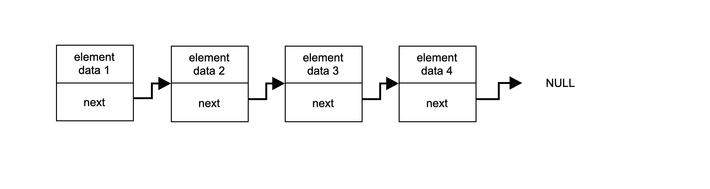
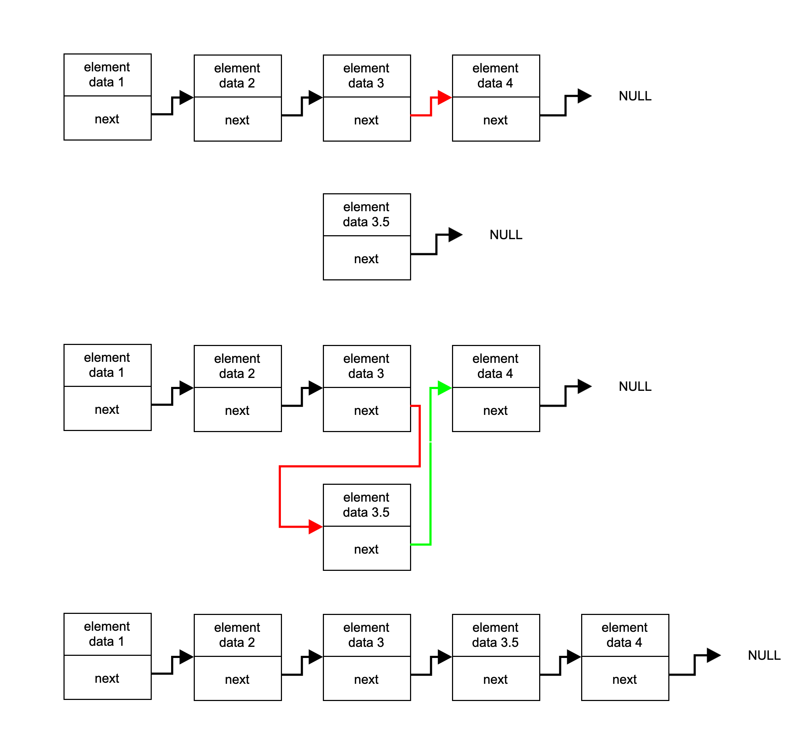
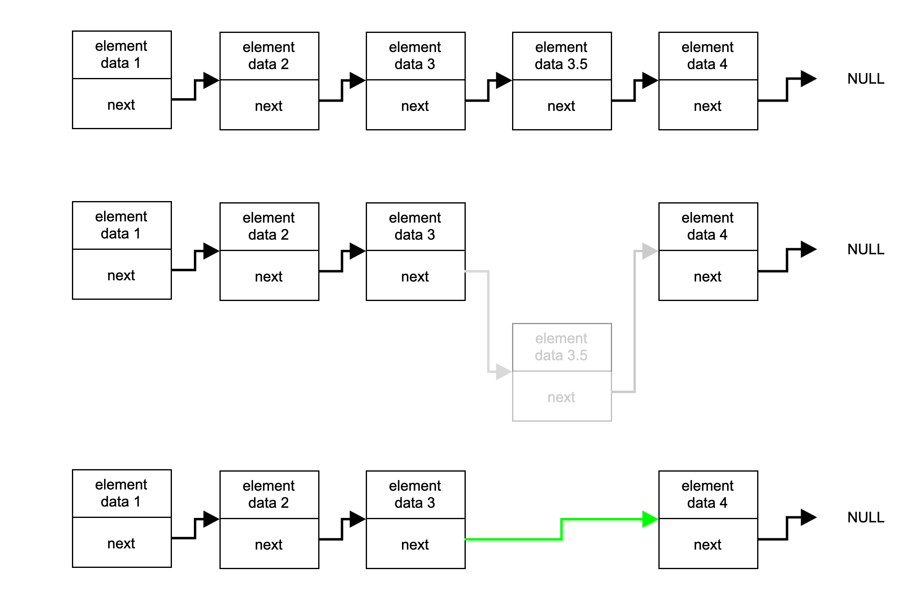

### List

 
  
Общая информация

 

List (список) - это последовательный контейнер, хранящий набор элементов произвольного размера в виде узлов, последовательно связанных указателями. Каждый узел хранит значение, соответствующее элементу списка, и указатель на следующий элемент. Такое устройство контейнера позволяет уйти от жестко фиксированного рамера, как, например, в статическом массиве, и делает более интуитивно понятным процесс добавления нового элемента в контейнер. 

Выше представлен пример списка из четырех элементов. Каждый из элементов списка представлен в виде структуры с двумя полями: значение узла и указатель на следующий элемент списка. Последний элемент списка ни на что не указывает. 

Подобное устройство списка позволяет простым образом (без каскадного сдвига) добавлять как в конец, так и в середину списка. При добавлении элемента в конкретную позицию списка создается новый узел, указывающий на следующий после данной позиции элемент, после чего указатель предыдущего элемента перемещается на новый.

При удалении элемента из списка, соответствующий узел освобождается, а указатели соседних элементов меняют значение: предыдущий элемент перемещает указатель на следующий после удаленного элемент.

Списки бывают односвязные или двусвязные. Односвязный список - это список, каждый узел которого хранит только один указатель: на следующий элемент списка (пример, приведенный выше). В двусвязном списке каждый узел хранит дополнительный указатель и на предыдущий элемент. Стандартная реализация контейнера list в С++ использует двусвязный список. 

В объекте класса контейнера хранятся указатели на "голову" и "хвост" списка, указывающие на первый и последний элементы списка. Контейнер List предоставляет прямой доступ только к "голове" и "хвосту", но позволяет добавлять и удалять элементы в любой части списка.

  
Спецификация

 

*List Member type*

В этой таблице перечислены внутриклассовые переопределения типов (типичные для стандартной библиотеки STL), принятые для удобства восприятия кода класса:

| Member type            | definition                                                                             |
|------------------------|----------------------------------------------------------------------------------------|
| `value_type`             | `T` defines the type of an element (T is template parameter)                                  |
| `reference`              | `T &` defines the type of the reference to an element                                                             |
| `const_reference`        | `const T &` defines the type of the constant reference                                         |
| `iterator`               | internal class `ListIterator<T>` defines the type for iterating through the container                                                 |
| `const_iterator`         | internal class `ListConstIterator<T>` defines the constant type for iterating through the container                                           |
| `size_type`              | `size_t` defines the type of the container size (standard type is size_t) |

*List Functions*

В этой таблице перечислены основные публичные методы для взаимодействия с классом:

| Functions      | Definition                                      |
|----------------|-------------------------------------------------|
| `list()`  | default constructor, creates empty list                                  |
| `list(size_type n)`  | parameterized constructor, creates the list of size n                                 |
| `list(std::initializer_list<value_type> const &items)`  | initializer list constructor, creates list initizialized using std::initializer_list<T>    |
| `list(const list &l)`  | copy constructor  |
| `list(list &&l)`  | move constructor  |
| `~list()`  | destructor  |
| `operator=(list &&l)`      | assignment operator overload for moving object                                |

*List Element access*

В этой таблице перечислены публичные методы для доступа к элементам класса:

| Element access | Definition                                      |
|----------------|-------------------------------------------------|
| `const_reference front()`          | access the first element                        |
| `const_reference back()`           | access the last element                         |

*List Iterators*

В этой таблице перечислены публичные методы для итерирования по элементам класса (доступ к итераторам):

| Iterators      | Definition                                      |
|----------------|-------------------------------------------------|
| `iterator begin()`    | returns an iterator to the beginning            |
| `iterator end()`        | returns an iterator to the end                  |

*List Capacity*

В этой таблице перечислены публичные методы для доступа к информации о наполнении контейнера:

| Capacity       | Definition                                      |
|----------------|-------------------------------------------------|
| `bool empty()`          | checks whether the container is empty           |
| `size_type size()`           | returns the number of elements                  |
| `size_type max_size()`       | returns the maximum possible number of elements |

*List Modifiers*

В этой таблице перечислены публичные методы для изменения контейнера:

| Modifiers      | Definition                                      |
|----------------|-------------------------------------------------|
| `void clear()`          | clears the contents                             |
| `iterator insert(iterator pos, const_reference value)`         | inserts element into concrete pos and returns the iterator that points to the new element     |
| `void erase(iterator pos)`          | erases element at pos                                 |
| `void push_back(const_reference value)`      | adds an element to the end                      |
| `void pop_back()`   | removes the last element        |
| `void push_front(const_reference value)`      | adds an element to the head                      |
| `void pop_front()`   | removes the first element        |
| `void swap(list& other)`                   | swaps the contents                                                                     |
| `void merge(list& other)`                   | merges two sorted lists                                                                      |
| `void splice(const_iterator pos, list& other)`                   | transfers elements from list other starting from pos             |
| `void reverse()`                   | reverses the order of the elements              |
| `void unique()`                   | removes consecutive duplicate elements               |
| `void sort()`                   | sorts the elements                |

